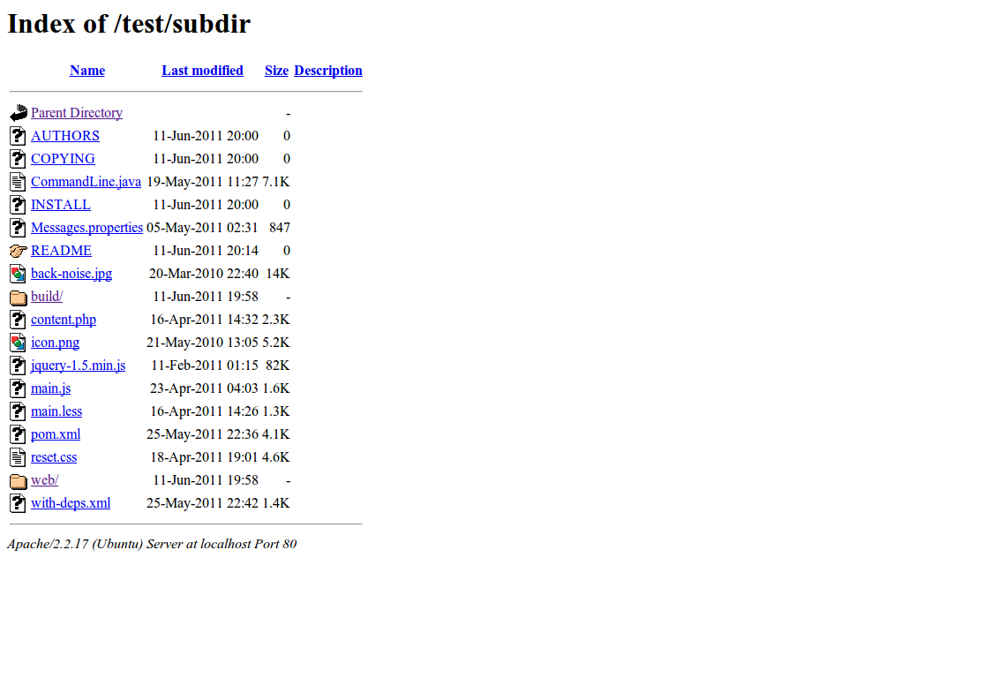

h5ai - a beautified Apache index
================================

Screenshot
----------

compare it to the built in index

Install
-------

* copy the `h5ai` folder to the web-root directory of your server
* add the content of file `dot-htaccess` to the `.htaccess` file in the directory
  you want to be indexed (you might have to create this file)

License
-------

This project is licensed under the [CC BY-SA 3.0 License](http://creativecommons.org/licenses/by-sa/3.0/).

It is based on the awesome [HTML5 Boilerplate](http://html5boilerplate.com) and the beautiful
[Faenza icon set](http://tiheum.deviantart.com/art/Faenza-Icons-173323228), please respect their rights.

